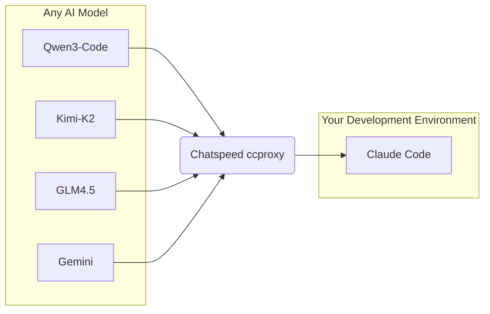
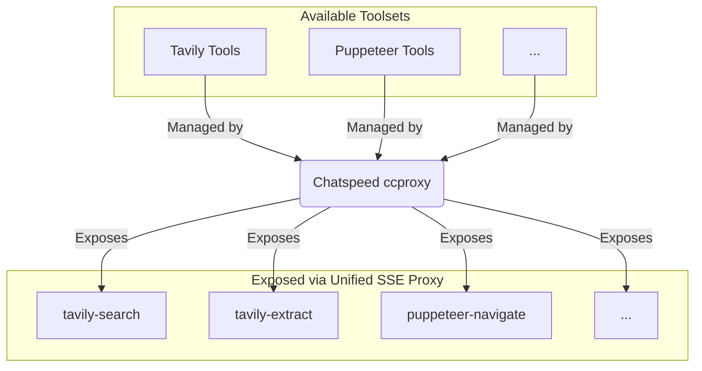

English | [简体中文](./README.zh-CN.md)

# ChatSpeed

**ChatSpeed lets you use `Claude Code` or `Gemini CLI` for free!**

Its core `ccproxy` module supports arbitrary protocol conversion between OpenAI, Gemini, Claude, Ollama, and more. This means you can seamlessly integrate any free or cost-effective model into development environments like `Claude Code`.

Additionally, `ccproxy`'s MCP proxy feature aggregates all MCP tools installed on ChatSpeed and serves them through a single, unified endpoint.

**AI Proxy Diagram**

**MCP Proxy Diagram**

The core mission is to democratize advanced AI integration, making it accessible, cost-effective, and efficient for developers worldwide.

## Core Advantages

- **Ultimate Cost Reduction**: Integrate any free or cost-effective models (e.g., Kimi, Qwen, GLM) into `Claude Code` or `Gemini CLI` and reduce development costs by over 80%.
- **Configure Once, Use Everywhere**: The unique unified `MCP` proxy eliminates the hassle of repeatedly configuring tools in multiple IDEs like VS Code, Cursor, and Zed.
- **Universal Protocol Conversion**: Seamlessly convert between major protocols like OpenAI, Claude, Gemini, and Ollama, and enable a "compatibility mode" for older models without native tool-calling capabilities.
- **Highly Flexible & Customizable**: Achieve optimal performance for various AI programming scenarios through advanced features like proxy grouping, dynamic routing, and prompt engineering.

## Documentation

**For detailed information, please visit our documentation website: [https://docs.chatspeed.aidyou.ai/](https://docs.chatspeed.aidyou.ai/)**

Our documentation includes:

- **[User Guide](https://docs.chatspeed.aidyou.ai/en/guide/)**: Installation, quick start, and feature overview.
- **[ccproxy Module](https://docs.chatspeed.aidyou.ai/en/ccproxy/)**: Learn how to use Claude Code at low cost or even for free.
- **[MCP Proxy](https://docs.chatspeed.aidyou.ai/en/mcp/)**: How to use the MCP proxy to centrally manage your commonly used MCP tools.
- **[API Reference](https://docs.chatspeed.aidyou.ai/en/api/)**: Complete API documentation.
- **[Development Guide](https://docs.chatspeed.aidyou.ai/en/guide/development.html)**: Instructions for setting up a development environment and building the project.

## Core Features

ChatSpeed offers a comprehensive suite of features to streamline your AI workflows, including AI agents, MCP proxy, multi-model support, an advanced chat interface, and more. For a full list of features, please see our [Features Overview](https://docs.chatspeed.aidyou.ai/en/guide/features/overview.html) in the documentation.

## Contributing

ChatSpeed is an open-source project under the MIT license. All code is available on [GitHub](https://github.com/aidyou/chatspeed). We welcome contributions from the community to help expand the AI agent ecosystem.
