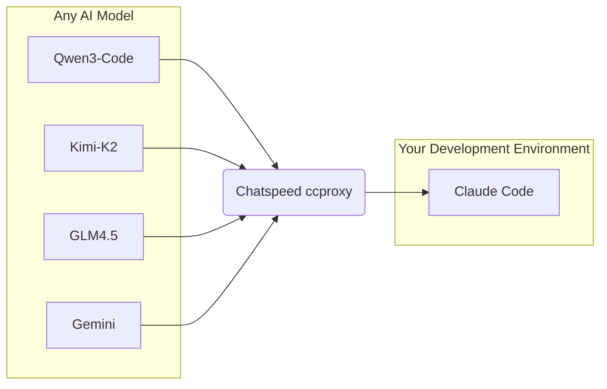
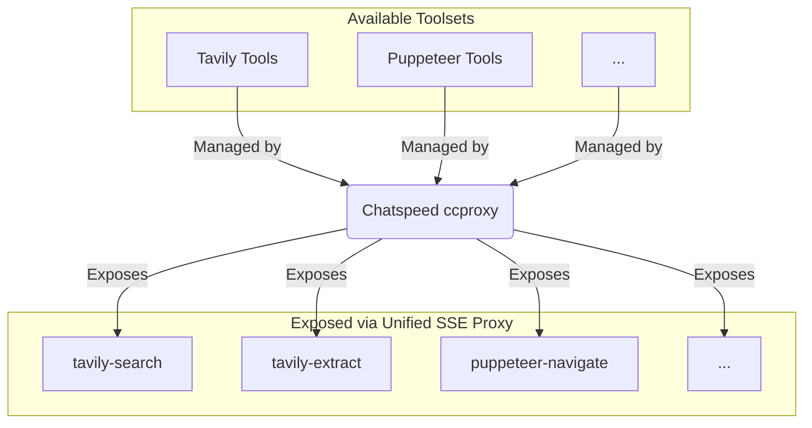

English | [简体中文](./README.zh-CN.md)


# ChatSpeed

**ChatSpeed lets you use `Claude Code` or `Gemini CLI` for free!**

Its core `ccproxy` module supports arbitrary protocol conversion between OpenAI, Gemini, Claude, Ollama, and more. This means you can seamlessly integrate any free or cost-effective model into development environments like `Claude Code`.

Additionally, `ccproxy`'s MCP proxy feature aggregates all MCP tools installed on ChatSpeed and serves them through a single, unified endpoint.

**AI Proxy Diagram**


**MCP Proxy Diagram**


The core mission is to democratize advanced AI integration, making it accessible, cost-effective, and efficient for developers worldwide.


## Core Features

ChatSpeed offers a comprehensive suite of features to streamline your AI workflows:

-   **AI Agent Management**:
    -   Unified platform to manage diverse AI chat and multimodal agents.
    -   Export configured agents as reusable tools for other applications.
    -   Seamless API integration and command-line tool output.

-   **MCP (Model Context Protocol) Proxy**:
    -   **Any Claude**: Integrate any AI model into the Claude ecosystem.
    -   **Any Gemini**: Connect any model to the Gemini CLI via `ccproxy`.
    -   Flexible proxy configuration for seamless model switching.

-   **Multi-Model Support**:
    -   Compatible with OpenAI, Gemini, Ollama, and Claude through OpenAI-compatible protocols.
    -   Support for multiple API keys per model with automatic rotation.
    -   Full parameter configuration (temperature, top_p, etc.) and custom HTTP proxy support.

-   **Web Search**:
    -   Integrated Google, Bing, and Baidu search engines.
    -   Real-time web retrieval to expand AI knowledge.
    -   Deep search with multi-query task decomposition.

-   **Advanced Chat Interface**:
    -   Clean UI with light/dark themes and multi-language support.
    -   Rich content parsing: code blocks, mind maps, flowcharts, tables, and formulas.
    -   Message referencing and resend capabilities.

-   **AI Assistant & Skills**:
    -   Instant Q&A and translation.
    -   AI-assisted generation of mind maps and flowcharts.
    -   Visual skill builder with hotkey support.

-   **Smart Notes & Data Security**:
    -   Save important conversations to a tag-based knowledge base.
    -   All data is encrypted and stored locally.
    -   Database backup and restore functionality.

## Open Source

ChatSpeed is an open-source project under the MIT license. All code is available on [GitHub](https://github.com/aidyou/chatspeed). We welcome contributions from the community to help expand the AI agent ecosystem.

## Installation

### Windows

1. Download the `.msi` installer from the [Releases page](https://github.com/aidyou/chatspeed/releases/latest).
2. Run the installer and follow the on-screen instructions.
3. You may see a Windows SmartScreen warning. Click "More info" and then "Run anyway" to proceed.

### macOS

**Important:** On newer versions of macOS, Gatekeeper security may prevent the app from opening, showing a "damaged" error message. This is because the app is not yet notarized by Apple.

Please use the following command-line instruction to bypass this:

1.  Drag the `.app` file from the mounted `.dmg` image to your **Applications** folder.
2.  Open the **Terminal** app.
3.  Run the following command (you may need to enter your password):
    ```sh
    sudo xattr -cr /Applications/Chatspeed.app
    ```
4.  After running the command, you can open the app normally.

### Linux

1. Download the `.AppImage` or `.deb` file from the [Releases page](https://github.com/aidyou/chatspeed/releases/latest).
2. For `.AppImage`, make the file executable (`chmod +x chatspeed*.AppImage`) and then run it.
3. For `.deb`, install it using your package manager (e.g., `sudo dpkg -i chatspeed*.deb`).

## Development Requirements

### System Dependencies

- sqlite3: Required for database operations
- bzip2: Required for compression functionality

### Recommended IDE Setup

- [VS Code](https://code.visualstudio.com/) + [Volar](https://marketplace.visualstudio.com/items?itemName=Vue.volar) + [Tauri](https://marketplace.visualstudio.com/items?itemName=tauri-apps.tauri-vscode) + [rust-analyzer](https://marketplace.visualstudio.com/items?itemName=rust-lang.rust-analyzer)

## Development

```sh
yarn install
yarn tauri dev
```

## Build

### Windows

#### Prerequisites

1. Install Visual Studio 2022 with:
   - "Desktop development with C++" workload
   - Windows SDK (10.0.22621.0 or later)
   - MSVC v143 - VS 2022 C++ x64/x86 build tools
   - For ARM64 builds: "MSVC v143 - VS 2022 C++ ARM64 build tools"

2. Install Node.js and Yarn

   ```sh
   # Install yarn if not already installed
   npm install -g yarn
   ```

3. Install Rust

   ```sh
   # Install from https://rustup.rs/
   rustup target add x86_64-pc-windows-msvc  # For x64 builds
   rustup target add aarch64-pc-windows-msvc # For ARM64 builds
   ```

4. Install Dependencies

   ```sh
   # Install project dependencies
   yarn install
   ```

5. Install and Configure vcpkg

   ```sh
   # Clone and bootstrap vcpkg
   git clone https://github.com/microsoft/vcpkg
   cd vcpkg
   .\bootstrap-vcpkg.bat

   # Install required libraries
   # For x64 builds:
   .\vcpkg install sqlite3:x64-windows-static-md
   .\vcpkg install bzip2:x64-windows-static-md

   # For ARM64 builds:
   .\vcpkg install sqlite3:arm64-windows-static-md
   .\vcpkg install bzip2:arm64-windows-static-md
   ```

#### Building

Option 1: Using automated build script (Recommended)

```sh
# This will automatically set up the environment and build
.\build.bat
```

Option 2: Manual build

```sh
# First, set up environment variables
.\setup-env.ps1  # PowerShell script (Recommended)
# or
.\setup-env.bat  # Batch script (For compatibility)

# Then build
yarn tauri build
```

The build output will be located in `src-tauri/target/release/`.

Note: The environment setup needs to be done each time you open a new command prompt window, as the environment variables are only valid for the current session.

### Linux

#### Prerequisites

```sh
# Install system dependencies (for Debian/Ubuntu)
sudo apt-get update
sudo apt-get install -y \
  build-essential \
  pkg-config \
  libssl-dev \
  libgtk-3-dev \
  libwebkit2gtk-4.1-dev \
  libayatana-appindicator3-dev \
  librsvg2-dev \
  libsoup-3.0-dev \
  libbz2-dev \
  libsqlite3-dev

# Install Node.js and Yarn
curl -fsSL https://deb.nodesource.com/setup_lts.x | sudo -E bash -
sudo apt-get install -y nodejs
npm install -g yarn

# Install Rust
curl --proto '=https' --tlsv1.2 -sSf https://sh.rustup.rs | sh
```

#### Building

```sh
# Install dependencies
yarn install

# Build
yarn tauri build
```

### macOS

#### Prerequisites

```sh
# Install Homebrew if not already installed
/bin/bash -c "$(curl -fsSL https://raw.githubusercontent.com/Homebrew/install/HEAD/install.sh)"

# Install system dependencies
brew install node
brew install yarn
brew install sqlite3

# Install Rust
curl --proto '=https' --tlsv1.2 -sSf https://sh.rustup.rs | sh
```

#### Building

```sh
# Install dependencies
yarn install

# Build without bundle
yarn tauri build --no-bundle

# Bundle for distribution outside the macOS App Store
yarn tauri bundle --bundles app,dmg
```
```

For more details about macOS distribution, please refer to the [Tauri documentation](https://v2.tauri.app/zh-cn/distribute/).
