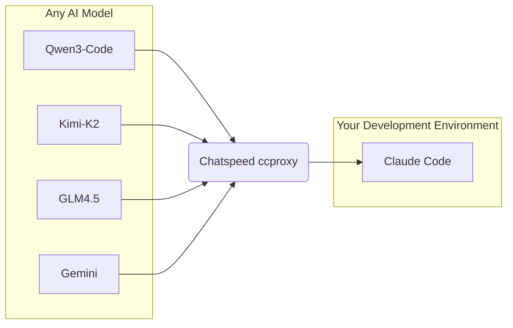
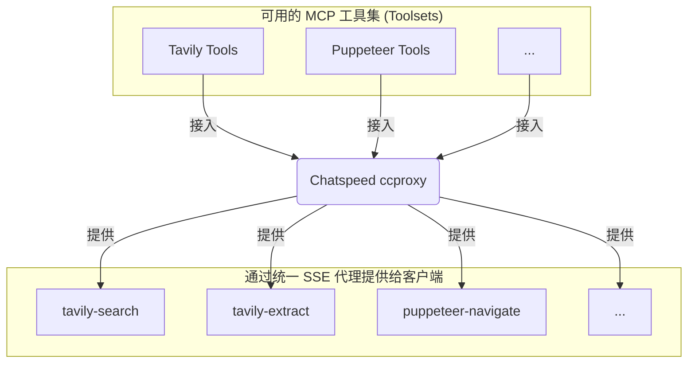

[English](./README.md) | 简体中文

# ChatSpeed

**ChatSpeed: Any Claude Code, Any Gemini CLI.**

**ChatSpeed 让你免费用上 `Claude Code` 或 `Gemini CLI`！**

它的核心模块 `ccproxy` 支持在 OpenAI、Gemini、Claude、Ollama 等协议间任意转换，这意味着你能将任何免费或高性价比的模型无缝接入到 `Claude Code` 等开发环境中。

同时，`ccproxy` 的 MCP 代理功能，会将安装在 ChatSpeed 上的所有 MCP 工具聚合成一个统一的入口，对外提供 `MCP` 工具。

**AI代理示意图**

**MCP代理示意图**

我们的核心使命是让先进的 AI 集成大众化，使全球的开发者都能以低成本、高效率的方式使用它。

## 核心优势

- **极致降本**: 将任意免费或高性价比模型（如 Kimi, Qwen, GLM）接入 `Claude Code` 或 `Gemini CLI`，开发成本立省80%以上。
- **一处配置，处处可用**: 独创的 `MCP` 统一代理，让你告别在 VS Code、Cursor、Zed 等多个 IDE 中重复配置工具的烦恼。
- **万能协议转换**: 无缝转换 OpenAI、Claude、Gemini、Ollama 等主流协议，并为无工具调用能力的老模型开启“兼容模式”。
- **高度灵活定制**: 通过代理分组、动态路由、提示词工程等高级功能，为不同场景下的 AI 编程提供最佳性能。

## 文档

**详细信息请访问我们的文档网站: [https://docs.chatspeed.aidyou.ai/](https://docs.chatspeed.aidyou.ai/)**

文档包括:

- **[用户指南](https://docs.chatspeed.aidyou.ai/zh/guide/)**: 安装、快速入门和功能概览。
- **[ccproxy 模块](https://docs.chatspeed.aidyou.ai/zh/ccproxy/)**: 了解如何低成本甚至免费使用 Claude Code。
- **[MCP 代理](https://docs.chatspeed.aidyou.ai/zh/mcp/)**: 如何使用MCP 代理集中管理您常用的 MCP 工具。
- **[API 参考](https://docs.chatspeed.aidyou.ai/zh/api/)**: 完整的 API 文档。
- **[开发指南](https://docs.chatspeed.aidyou.ai/zh/guide/development.html)**: 有关设置开发环境和构建项目的说明。

## 核心功能

ChatSpeed 提供了一套全面的功能来简化您的 AI 工作流，包括 AI 代理、MCP 代理、多模型支持、高级聊天界面等等。有关功能的完整列表，请参阅我们文档中的[功能概览](https://docs.chatspeed.aidyou.ai/zh/guide/features/overview.html)。

## 欢迎贡献代码

ChatSpeed 是一个遵循 MIT 许可的开源项目。所有代码都托管在 [GitHub](https://github.com/aidyou/chatspeed) 上。我们欢迎社区的贡献，共同扩展 AI 代理生态系统。