[English](./README.md) | 简体中文

# ChatSpeed

**ChatSpeed: Any Claude, Any Gemini.**

ChatSpeed 是一款创新的开源 AI 代理管理平台，它革命性地改变了您与 AI 模型的交互方式。基于 Tauri 和 Vue 3 构建，它超越了传统的聊天界面，作为一个统一的代理系统运行。通过先进的代理管理和我们的 MCP（模型上下文协议）代理，ChatSpeed 可以将*任何* AI 模型无缝集成到 `Claude Code` 生态系统或 `Gemini CLI` 中。

**AI代理示意图**


**MCP代理示意图**

```mermaid
graph LR
    A[任何客户端 App] --> B(Chatspeed ccproxy)

    subgraph "由 Chatspeed 管理的 MCP 工具集"
        C[Tavily 工具]
        D[Puppeteer 工具]
        E[...]
    end

    B --> C
    B --> D
    B --> E
```


我们的核心使命是让先进的 AI 集成大众化，使全球的开发者都能以低成本、高效率的方式使用它。

🎉 **首个版本发布！** 🎉

ChatSpeed 现已可用。我们欢迎来自社区的反馈和贡献！

## 核心功能

ChatSpeed 提供了一套全面的功能来简化您的 AI 工作流：

-   **AI 代理管理**:
    -   统一平台管理各种 AI 聊天代理和多模态内容代理。
    -   将配置好的 AI 代理导出为可复用工具供其他应用使用。
    -   无缝的 API 集成和命令行工具输出能力。

-   **MCP (模型上下文协议) 代理**:
    -   **Any Claude**: 将任何 AI 模型集成到 Claude 生态系统。
    -   **Any Gemini**: 通过 `ccproxy` 将任何模型连接到 Gemini CLI。
    -   灵活的代理配置，实现无缝模型切换。

-   **多模型支持**:
    -   通过 OpenAI 兼容协议，兼容 OpenAI、Gemini、Ollama 和 Claude。
    -   支持单个模型配置多个 API 密钥，并自动轮换使用。
    -   完整的模型参数配置（temperature, top_p 等）和自定义 HTTP 代理支持。

-   **联网搜索**:
    -   集成了 Google、Bing、百度搜索引擎。
    -   实时网络检索，扩展 AI 的知识边界。
    -   通过多查询任务分解实现深度搜索。

-   **高级聊天界面**:
    -   简洁的 UI，支持明/暗色主题和多语言。
    -   丰富的消息内容解析：代码块、思维导图、流程图、表格和公式。
    -   消息引用和重新发送功能。

-   **智能助手与技能**:
    -   即时问答和翻译。
    -   AI 辅助生成思维导图和流程图。
    -   可视化的技能构建器，支持快捷键。

-   **智记与数据安全**:
    -   将重要的对话保存到基于标签的知识库中。
    -   所有数据都在本地加密存储。
    -   数据库备份和恢复功能。

## 开源

ChatSpeed 是一个遵循 MIT 许可的开源项目。所有代码都托管在 [GitHub](https://github.com/aidyou/chatspeed) 上。我们欢迎社区的贡献，共同扩展 AI 代理生态系统。

## 安装指南

### Windows

1.  从 [Releases 页面](https://github.com/aidyou/chatspeed/releases/latest)下载 `.msi` 安装程序。
2.  运行安装程序并按照屏幕上的提示操作。
3.  您可能会看到 Windows SmartScreen 警告。请点击“更多信息”，然后点击“仍要运行”以继续。

### macOS

**重要提示：** 在较新版本的 macOS 上，Gatekeeper 安全机制可能会阻止应用运行，并提示文件“已损坏”。这是因为应用尚未经过苹果公证。

请使用以下终端命令来解决此问题：

1.  将 `.app` 文件从挂载的 `.dmg` 镜像中拖拽到您的“应用程序”文件夹。
2.  打开“终端”应用 (Terminal)。
3.  执行以下命令 (可能需要输入您的系统密码):
    ```sh
    sudo xattr -cr /Applications/Chatspeed.app
    ```
4.  命令执行成功后，您就可以正常打开应用了。

### Linux

1.  从 [Releases 页面](https://github.com/aidyou/chatspeed/releases/latest)下载 `.AppImage` 或 `.deb` 文件。
2.  对于 `.AppImage` 文件，请先为其添加可执行权限 (`chmod +x chatspeed*.AppImage`)，然后直接运行。
3.  对于 `.deb` 文件，请使用您的包管理器进行安装 (例如 `sudo dpkg -i chatspeed*.deb`)。

## 开发要求

### 系统依赖

- sqlite3: 数据库操作所需
- bzip2: 压缩功能所需

### 推荐的 IDE 设置

- [VS Code](https://code.visualstudio.com/) + [Volar](https://marketplace.visualstudio.com/items?itemName=Vue.volar) + [Tauri](https://marketplace.visualstudio.com/items?itemName=tauri-apps.tauri-vscode) + [rust-analyzer](https://marketplace.visualstudio.com/items?itemName=rust-lang.rust-analyzer)

## 开发

```sh
yarn install
yarn tauri dev
```

## 构建

### Windows

#### 环境准备

1. 安装 Visual Studio 2022，并包含以下组件：
   - "使用 C++ 的桌面开发" 工作负载
   - Windows SDK (10.0.22621.0 或更高版本)
   - MSVC v143 - VS 2022 C++ x64/x86 生成工具
   - 对于 ARM64 构建: "MSVC v143 - VS 2022 C++ ARM64 生成工具"

2. 安装 Node.js 和 Yarn

   ```sh
   # 如果尚未安装 yarn，请先安装
   npm install -g yarn
   ```

3. 安装 Rust

   ```sh
   # 从 https://rustup.rs/ 安装
   rustup target add x86_64-pc-windows-msvc  # 用于 x64 构建
   rustup target add aarch64-pc-windows-msvc # 用于 ARM64 构建
   ```

4. 安装依赖

   ```sh
   # 安装项目依赖
   yarn install
   ```

5. 安装和配置 vcpkg

   ```sh
   # 克隆并引导 vcpkg
   git clone https://github.com/microsoft/vcpkg
   cd vcpkg
   .ootstrap-vcpkg.bat

   # 安装所需库
   # 用于 x64 构建:
   .
vcpkg install sqlite3:x64-windows-static-md
   .
vcpkg install bzip2:x64-windows-static-md

   # 用于 ARM64 构建:
   .
vcpkg install sqlite3:arm64-windows-static-md
   .
vcpkg install bzip2:arm64-windows-static-md
   ```

#### 构建

选项 1: 使用自动化构建脚本 (推荐)

```sh
# 该脚本将自动设置环境并构建
.uild.bat
```

选项 2: 手动构建

```sh
# 首先，设置环境变量
.setup-env.ps1  # PowerShell 脚本 (推荐)
# 或
.setup-env.bat  # Bat 脚本 (用于兼容性)

# 然后构建
 yarn tauri build
```

构建产物将位于 `src-tauri/target/release/`。

注意: 每次打开新的命令提示符窗口时都需要重新设置环境，因为环境变量仅在当前会话中有效。

### Linux

#### 环境准备

```sh
# 安装系统依赖 (适用于 Debian/Ubuntu)
sudo apt-get update
sudo apt-get install -y \
  build-essential \
  pkg-config \
  libssl-dev \
  libgtk-3-dev \
  libwebkit2gtk-4.1-dev \
  libayatana-appindicator3-dev \
  librsvg2-dev \
  libsoup-3.0-dev \
  libbz2-dev \
  libsqlite3-dev

# 安装 Node.js 和 Yarn
curl -fsSL https://deb.nodesource.com/setup_lts.x | sudo -E bash -
sudo apt-get install -y nodejs
npm install -g yarn

# 安装 Rust
curl --proto ='https' --tlsv1.2 -sSf https://sh.rustup.rs | sh
```

#### 构建

```sh
# 安装依赖
yarn install

# 构建
yarn tauri build
```

### macOS

#### 环境准备

```sh
# 如果尚未安装 Homebrew，请先安装
/bin/bash -c "$(curl -fsSL https://raw.githubusercontent.com/Homebrew/install/HEAD/install.sh)"

# 安装系统依赖
brew install node
brew install yarn
brew install sqlite3

# 安装 Rust
curl --proto ='https' --tlsv1.2 -sSf https://sh.rustup.rs | sh
```

#### 构建

```sh
# 安装依赖
yarn install

# 构建 (不打包)
yarn tauri build --no-bundle

# 打包为可在 macOS App Store 之外分发的应用
yarn tauri bundle --bundles app,dmg
```
```

关于 macOS 分发的更多详情，请参考 [Tauri 文档](https://v2.tauri.app/zh-cn/distribute/)。

```
